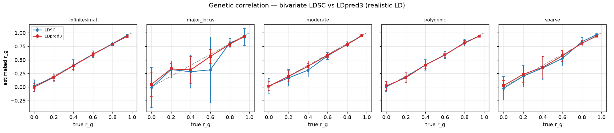
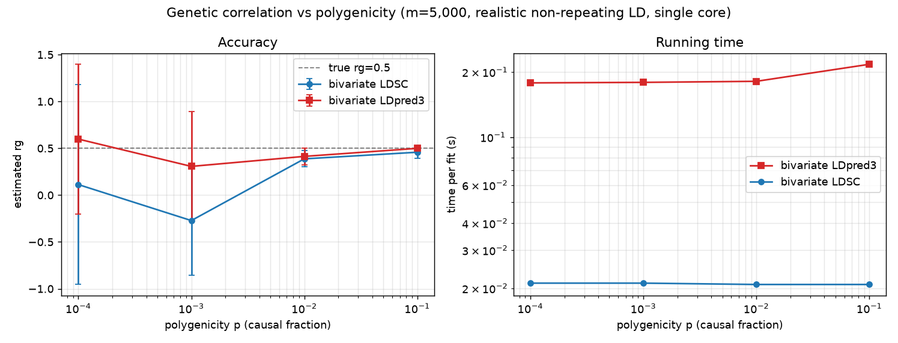
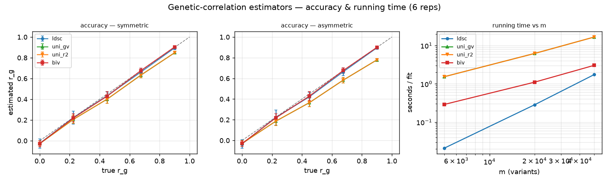
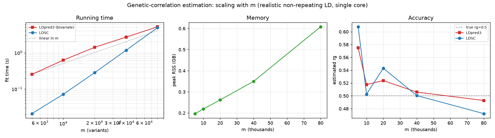
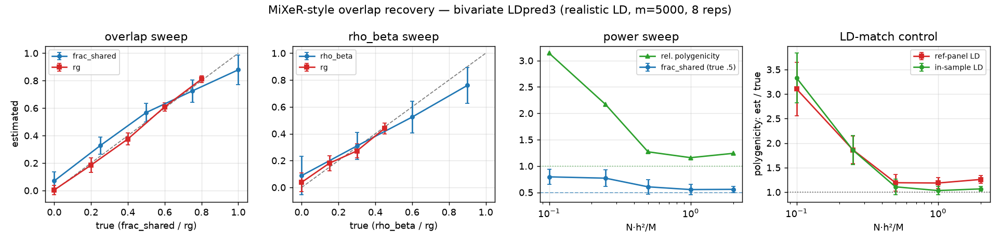

# bipred benchmark results

Summary of the **bivariate-LDpred (bipred)** benchmark suite. Unless noted, each
genome is a realistic **non-repeating coalescent** simulation (`msprime`), so the
LD is real (long-range structure, recombination hotspots) with known ground
truth. LD is stored **int8**-quantised (the default representation).

- **Regenerated:** 2026-07-06, on numpy 2.2.6 / numba 0.66 / msprime 1.4.
- **Reproduce:** `OPENBLAS_NUM_THREADS=1 python benchmarks/<script>.py` (see
  [`README.md`](README.md) for what each script measures).
- **Caveat:** these are *stochastic* benchmarks; every number is one Monte-Carlo
  run, so re-running shifts values. Treat the environmental-overlap section as a
  stress test, not a stable recovery claim.

## Headline findings

- **Bivariate LDpred3 halves the genetic-correlation error of cross-trait LDSC** —
  mean |r̂g − rg| of **0.021 vs 0.042** across five architectures, at roughly
  **half the sampling SD** (0.063 vs 0.120).
- **The gain grows under asymmetric power** (one weak trait): biv MAE 0.019 vs
  LDSC 0.040 and univariate-effect estimators ~0.048.
- **Fast:** the bivariate fit takes **0.25 s at 5k variants** and **3.37 s at 80k**
  in the committed runs, and scales to **80k variants at <0.7 GB**.
- **Polygenic overlap** (`res.mixer`) recovers the shared fraction monotonically;
  ratios (`frac_shared`, `rho_beta`) are reliable, absolute counts approximate.
- In the idealized **sample-overlap** sweep, overlap biases rg upward unless
  `cross_corr` is set; the separate environmental-overlap stress test is much
  noisier and does not establish robust recovery by the bivariate correction.

---

## 1. Genetic correlation across architectures

rg recovery across five genetic architectures × six true-rg values, comparing
cross-trait LDSC with the bivariate joint fit. Table shows mean absolute error
(MAE) and mean sampling SD, averaged over the six rg points (10 reps each).

**Table 1. Genetic-correlation accuracy by architecture.**

| Architecture | LDSC MAE | LDSC SD | **LDpred3 MAE** | **LDpred3 SD** |
|---|---:|---:|---:|---:|
| infinitesimal | 0.010 | 0.045 | 0.021 | **0.024** |
| sparse | 0.082 | 0.149 | **0.018** | **0.100** |
| moderate | 0.031 | 0.080 | **0.015** | **0.046** |
| polygenic | 0.014 | 0.079 | **0.012** | **0.033** |
| major_locus | 0.071 | 0.249 | **0.040** | **0.115** |
| **all** | 0.042 | 0.120 | **0.021** | **0.063** |

LDpred3 wins on every non-infinitesimal architecture and always has the tighter
SD. LDSC edges it on point accuracy only for the infinitesimal case, where its
moment assumptions hold exactly — but even there LDpred3's SD is ~2× smaller.

**Figure 1. Genetic-correlation estimates across architectures.**

## 2. Genetic correlation vs polygenicity

rg recovery (true rg = 0.5) as the causal fraction `p` drops from 0.1 to 1e-4
(fewer causal variants → weaker signal).

**Table 2. Genetic-correlation recovery by polygenicity.**

| p | # causal | LDSC r̂g (sd) | **LDpred3 r̂g (sd)** |
|---:|---:|---:|---:|
| 0.1 | 500 | 0.469 (0.094) | **0.498 (0.034)** |
| 0.01 | 50 | 0.263 (0.237) | **0.429 (0.066)** |
| 0.001 | 5 | 0.407 (0.572) | 0.315 (0.590) |
| 0.0001 | ~0 | −0.550 (0.764) | 0.598 (0.796) |

LDpred3 stays close to truth with a far tighter SD down to ~50 causal variants;
below that (≤5 causal) neither estimator is identified and both have huge SD.

**Figure 2. Genetic-correlation estimates by polygenicity.**

## 3. rg estimators compared

Four estimators — cross-trait LDSC, two univariate-effect estimators (`uni_gv`,
`uni_r2`) and the bivariate joint fit (`biv`) — at symmetric and asymmetric power.
Values are mean absolute error over five true-rg points.

**Table 3. Estimator error by power setting.**

| Power setting | LDSC | uni_gv | uni_r2 | **biv** |
|---|---:|---:|---:|---:|
| symmetric (N=50k / 50k) | 0.039 | 0.027 | 0.026 | **0.016** |
| asymmetric (N=50k / 10k) | 0.040 | 0.048 | 0.047 | **0.019** |

The bivariate fit is the most accurate in both regimes, and its lead **widens
when one trait is under-powered** (where the univariate-effect estimators
degrade). Per-fit running time also favours it:

**Table 4. Estimator running time by variant count.**

| m | # blocks | LDSC | uni_gv / uni_r2 | **biv** |
|---:|---:|---:|---:|---:|
| 5,000 | 25 | 0.02s | 1.25s | **0.25s** |
| 20,000 | 100 | 0.23s | 5.42s | **0.98s** |
| 50,000 | 250 | 1.30s | 15.6s | **2.48s** |

**Figure 3. Genetic-correlation estimator comparison.**

## 4. Scaling with m

Per-fit time, peak memory and accuracy (true rg = 0.5) as the variant count grows
to 80k, one subprocess per size.

**Table 5. Scaling results by variant count.**

| m | # blocks | LDSC time | LDpred3 time | peak RSS | LDpred3 r̂g |
|---:|---:|---:|---:|---:|---:|
| 5,000 | 25 | 0.02s | 0.22s | 0.25 GB | 0.494 |
| 10,000 | 50 | 0.07s | 0.45s | 0.30 GB | 0.504 |
| 20,000 | 100 | 0.24s | 0.90s | 0.33 GB | 0.520 |
| 40,000 | 200 | 0.95s | 1.86s | 0.40 GB | 0.497 |
| 80,000 | 400 | 3.47s | 3.37s | 0.62 GB | 0.475 |

Time grows roughly linearly in m (block-diagonal LD), memory stays under 0.7 GB
at 80k variants, and accuracy holds across the range.

**Figure 4. Running time, memory, and accuracy scaling.**

## 5. Polygenic overlap (MiXeR-style)

`res.mixer` decomposes the four-state mixture into a polygenic-overlap summary.
The **overlap sweep** varies the true shared fraction (fixed within-shared
ρ_β = 0.8):

**Table 6. Polygenic-overlap recovery.**

| true frac_shared | frac_shared_hat (sd) | true rg | rg_from_overlap (sd) |
|---:|---:|---:|---:|
| 0.00 | 0.046 (0.028) | 0.0 | −0.003 (0.023) |
| 0.25 | 0.323 (0.067) | 0.2 | 0.176 (0.064) |
| 0.50 | 0.578 (0.068) | 0.4 | 0.346 (0.063) |
| 0.75 | 0.841 (0.033) | 0.6 | 0.528 (0.025) |
| 1.00 | 0.983 (0.005) | 0.8 | 0.744 (0.012) |

The estimated shared fraction is **monotone and well-ordered** in the truth. The
`rho` sweep recovers within-shared ρ_β up to a mild attenuation at high ρ_β, and
the noise-inflation calibration (`noise_inflation=True`) pulls the
reference-panel-mismatch count inflation (relative polygenicity rising to ~1.2)
back toward 1. **Ratios are reliable; absolute counts are approximate** — anchor
them with `res.mixer_calibrated(...)` for count-sensitive work.

**Figure 5. MiXeR-style overlap results.**

## 6. Sample overlap and `cross_corr`

rg sensitivity to shared GWAS samples, and the `cross_corr` correction.
`rg_cc0` leaves overlap uncorrected; `rg_cctrue` passes the true `cross_corr`.

**Table 7. Idealized sample-overlap correction.**

| true rg | overlap ρ | rg (cross_corr=0) | rg (cross_corr set) | bias removed |
|---:|---:|---:|---:|---:|
| 0.0 | 0.0 | −0.001 | −0.001 | — |
| 0.0 | 0.2 | 0.013 | −0.001 | 0.013 |
| 0.0 | 0.4 | 0.026 | −0.001 | 0.026 |
| 0.5 | 0.0 | 0.505 | 0.505 | — |
| 0.5 | 0.2 | 0.517 | 0.506 | 0.012 |
| 0.5 | 0.4 | 0.529 | 0.506 | 0.024 |

Uncorrected sample overlap biases rg **upward** in proportion to the overlap;
setting `cross_corr` removes it.

## 7. Environmental correlation on shared samples

Stress test under an **environmental** correlation `re` on shared samples (real
individual-level genotypes), comparing LDSC with a free vs constrained intercept
and the bivariate fit with `cross_corr` off vs on. Every committed CSV row is
shown, including the high-error `rg=0`, `re=0.6` cell.

**Table 8. Environmental-overlap estimates, mean ± SD over retained replicates.**

| true rg | re | LDSC free | LDSC constrained | biv cc=0 | biv cc set | LDSC intercept |
|---:|---:|---:|---:|---:|---:|---:|
| 0.0 | 0.0 | −0.0192 ± 0.1325 | −0.0457 ± 0.0872 | 0.0290 ± 0.2329 | 0.0237 ± 0.2362 | −0.5903 |
| 0.0 | 0.3 | −0.0047 ± 0.1299 | −0.0240 ± 0.0818 | −0.0545 ± 0.2293 | 0.0394 ± 0.2351 | −0.4254 |
| 0.0 | 0.6 | −0.0181 ± 0.1182 | −0.0075 ± 0.0879 | −0.0957 ± 0.4420 | 0.7402 ± 0.4181 | 0.2541 |
| 0.5 | 0.0 | 0.5223 ± 0.1005 | 0.5036 ± 0.1041 | −0.2697 ± 0.7256 | 0.1808 ± 0.5940 | −0.3967 |
| 0.5 | 0.6 | 0.4841 ± 0.1243 | 0.5135 ± 0.1044 | −0.4208 ± 0.6954 | 0.3921 ± 0.5110 | 0.6771 |

The script's `agg()` function excludes non-finite estimates and estimates with
`|rg| > 1.5` before computing each mean and SD. Table 8 is therefore conditional
on that retained diagnostic window and can understate divergence; the committed
CSV does not record how many replicates were excluded.

The free-intercept LDSC means are near truth in this run. The bivariate
`cross_corr` correction is not reliably recovered: it gives `0.7402 ± 0.4181`
when truth is zero at `re=0.6`, and `0.1808 ± 0.5940` when truth is `0.5` at
`re=0`. Supplying the mechanistically intended correction improves some cells,
but this artifact does not support a general recovery claim.

---

*Not regenerated here (require external datasets not present locally):*
`bivariate_demo.py` (needs `ld_library.npz`) and `hapnest/run_bivariate.py`
(needs a HAPNEST dataset). See [`README.md`](README.md) and
[`hapnest/README.md`](hapnest/README.md).
