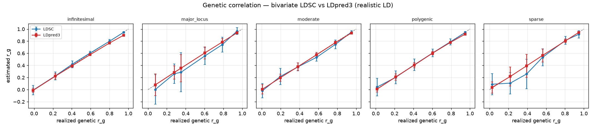
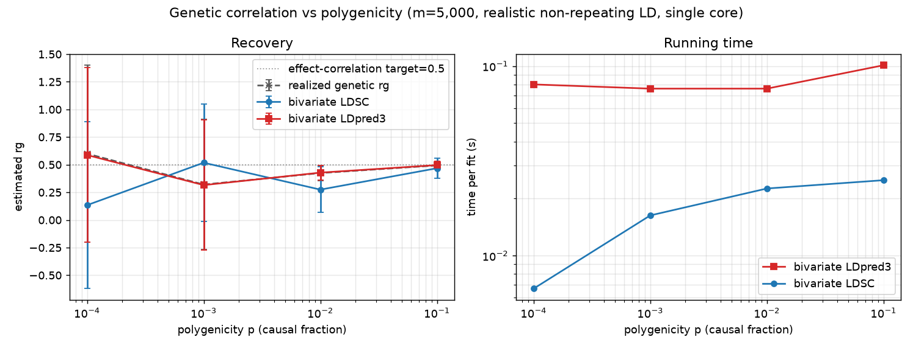
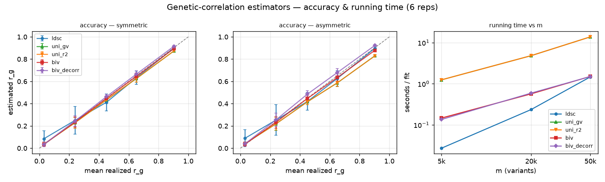
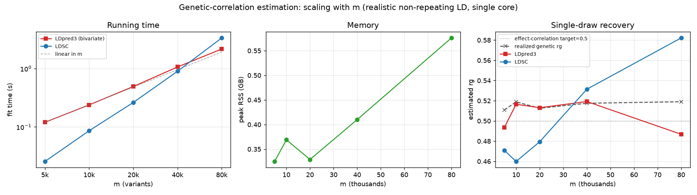
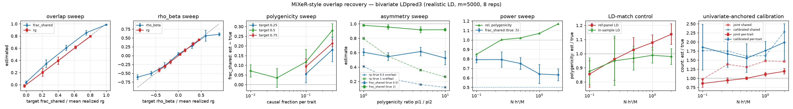

# Benchmarks for bipred 0.2.1

These artifacts were regenerated on 2026-08-04 from benchmark source revision
`63c8774` (bipred 0.2.1), against the same cached simulation truths as the
2026-08-03 snapshot (revision `17d6ae2`, bipred 0.2.0). Every accuracy column
is byte-identical to that snapshot; only the timing and memory columns
(`*_t`, `peak_gb`, `t_ldpred3_s`, `t_ldsc_s`) and the figures moved.
[External runs](#external-runs) (HAPNEST, SBayesS) were not regenerated and
remain 0.2.0 measurements, as declared there.

Simulation backend: msprime 1.4.2 (default where installed). The fallback
bundled Numba coalescent (`benchmarks/_coalescent.py`) is available when
msprime is absent; it draws different events from the same model, so cached
segments are tagged per backend and never mix.

**Table 1. Recorded environment.**

| Component | Value |
|---|---|
| Python | 3.14.6 |
| bipred | 0.2.1 |
| ldpred3 | 0.4.3 |
| NumPy / Numba | 2.4.6 / 0.66.0 |
| msprime / Matplotlib | 1.4.2 / 3.11.1 |
| Platform | Darwin 25.5.0, arm64 |
| Numerical threads | 1 |

All timing runs used one OpenBLAS, OMP, MKL, Numba, and NumExpr thread. Times
are machine-specific. Peak RSS includes simulation, LD construction, reference
panels, and JIT state present in each process.

## Reading the results

The generating parameter is an effect-correlation target. A finite causal draw
under LD generally has a different genetic correlation. Every accuracy column
therefore uses paired error against that replicate's realized

**Equation 1. Realized LD-adjusted genetic correlation.**

```text
r_g = beta1' R beta2 /
      sqrt((beta1' R beta1) (beta2' R beta2)).
```

That distinction matters most for sparse architectures. The previous artifacts
scored against the target and could mislabel Monte Carlo variation as estimator
error.

Other limits are equally important:

- most runs simulate the fitted `beta_hat ~ N(R beta, R / N)` model, so they
  favor a model-based estimator;
- estimates outside `|r_g| <= 1.5` are counted as failures before summaries;
- the environmental-overlap run is an intentionally out-of-model stress test;
- Monte Carlo sizes range from 5 to 20 replicates, not publication-scale
  calibration studies; and
- external HAPNEST, cached-LD, and GCTB runs were not available.

## 1. Genetic correlation across architectures

The main sweep has five architectures, six targets, and ten replicates per cell
at 5,000 variants. MAE is computed per replicate against realized genetic
correlation, then averaged over the six targets.

**Table 2. Paired genetic-correlation error by architecture.**

| Architecture | LDSC MAE | LDpred3 MAE | LDSC mean SD | LDpred3 mean SD | Failures, LDSC / LDpred3 |
|---|---:|---:|---:|---:|---:|
| infinitesimal | 0.0289 | 0.0215 | 0.0448 | 0.0238 | 0 / 0 |
| sparse | 0.0914 | 0.0075 | 0.1434 | 0.0990 | 0 / 0 |
| moderate | 0.0583 | 0.0108 | 0.0800 | 0.0460 | 0 / 0 |
| polygenic | 0.0484 | 0.0134 | 0.0802 | 0.0325 | 0 / 0 |
| major locus | 0.0989 | 0.0079 | 0.1748 | 0.1152 | 4 / 0 |
| **All cells** | **0.0652** | **0.0122** | **0.1047** | **0.0633** | **4 / 0** |

Within this likelihood-matched simulation, the joint fit has lower paired MAE
in 26 of 30 cells and lower SD in all 30. It does not win everywhere:
high-correlation shrinkage is visible. In the infinitesimal target-0.95 cell,
realized r_g was 0.9509, while the joint and LDSC means were 0.8998 and 0.9474.
This is evidence for the tested model and geometry, not a universal ranking over
real GWAS.

**Figure 1. Genetic-correlation estimates across architectures.**



## 2. Polygenicity

At very low polygenicity, the realized truth itself becomes highly variable.
The expected causal count includes the script's enforced minimum of one causal
variant.

**Table 3. Recovery as the causal fraction decreases.**

| Causal fraction | Expected / observed causal count | Realized r_g, mean ± SD | LDSC MAE | LDpred3 MAE | Failures, LDSC / LDpred3 |
|---:|---:|---:|---:|---:|---:|
| 0.1 | 500.0 / 492.6 | 0.494 ± 0.030 | 0.0491 | 0.0089 | 0 / 0 |
| 0.01 | 50.0 / 45.2 | 0.425 ± 0.071 | 0.1734 | 0.0105 | 0 / 0 |
| 0.001 | 5.007 / 3.6 | 0.320 ± 0.589 | 0.3159 | 0.0107 | 0 / 0 |
| 0.0001 | 1.107 / 1.0 | 0.600 ± 0.800 | 0.2448 | 0.0043 | 3 / 0 |

At one realized causal variant, genetic correlation is essentially a
sign-dominated quantity. The large SD is not evidence that the target 0.5 was
missed; the estimator must recover the realized draw.

**Figure 2. Genetic-correlation recovery by polygenicity.**



## 3. Estimator comparison

The comparison uses five target points and six replicates at symmetric
`N=50k/50k` and asymmetric `N=50k/10k` power.

**Table 4. Mean paired MAE across the target grid.**

| Estimator | Symmetric MAE | Asymmetric MAE | Mean 5k fit time, symmetric |
|---|---:|---:|---:|
| LDSC | 0.0542 | 0.0608 | 0.054 s |
| two univariate fits, `uni_gv` | 0.0190 | 0.0422 | 1.894 s |
| two univariate fits, `uni_r2` | 0.0184 | 0.0420 | 1.894 s |
| joint default | **0.0084** | **0.0174** | 0.240 s |
| joint cross-sweep sensitivity | 0.0110 | 0.0240 | 0.265 s |

No estimator failed in these cells. The cross-sweep
`rg_decorrelated=True` estimator did not improve on the default, including in
the asymmetric setting. It remains a sensitivity analysis, not a preferred
replacement.

**Table 5. Single-core timing scan.**

| Variants | Blocks | LDSC | Two univariate fits | Joint default | Joint cross-sweep |
|---:|---:|---:|---:|---:|---:|
| 5,000 | 25 | 0.033 s | 1.639 s | 0.233 s | 0.239 s |
| 20,000 | 100 | 0.523 s | 6.206 s | 0.939 s | 0.932 s |
| 50,000 | 250 | 3.367 s | 16.223 s | 2.365 s | 2.387 s |

`uni_gv` and `uni_r2` reuse the same two univariate fits, so their recorded cost
is identical.

**Figure 3. Estimator accuracy and running time.**



## 4. Scaling

Each size runs in a fresh subprocess and reports one realized draw.

**Table 6. Scaling with variant count.**

| Variants | LDSC time | LDpred3 time | Peak RSS | Realized r_g | LDSC absolute error | LDpred3 absolute error |
|---:|---:|---:|---:|---:|---:|---:|
| 5,000 | 0.062 s | 0.241 s | 0.310 GB | 0.511 | 0.0399 | 0.0185 |
| 10,000 | 0.192 s | 0.458 s | 0.351 GB | 0.519 | 0.0590 | 0.0031 |
| 20,000 | 0.510 s | 0.888 s | 0.396 GB | 0.513 | 0.0332 | 0.0019 |
| 40,000 | 2.193 s | 1.676 s | 0.495 GB | 0.518 | 0.0138 | 0.0021 |
| 80,000 | 8.091 s | 3.293 s | 0.662 GB | 0.519 | 0.0632 | 0.0355 |

Peak RSS grows sublinearly across this range (0.31 GB to 0.66 GB for a 16x
variant count). LDSC time grows faster than the joint fit's and overtakes it
between 20k and 40k variants. The earlier 0.2.0 record showed a 2.51 GB spike
at 80k; the regenerated run does not reproduce it, so treat single-run memory
figures as machine- and allocator-dependent rather than as a property of the
method. This sweep measures the default dense/Q8 path, not million-variant LR8
production behavior.

**Figure 4. Running time, memory, and single-draw recovery.**



## 5. Polygenic overlap

The overlap sweep fixes per-trait causal fraction at 0.1 and within-shared
effect-correlation target at 0.8.

**Table 7. MiXeR-style overlap sweep.**

| Shared-fraction target | Estimated shared fraction ± SD | Realized r_g | Joint r_g / MAE | Overlap-derived r_g / MAE |
|---:|---:|---:|---:|---:|
| 0.00 | 0.041 ± 0.023 | -0.020 | -0.020 / 0.010 | -0.005 / 0.018 |
| 0.25 | 0.343 ± 0.082 | 0.206 | 0.203 / 0.010 | 0.172 / 0.033 |
| 0.50 | 0.595 ± 0.069 | 0.401 | 0.394 / 0.010 | 0.337 / 0.064 |
| 0.75 | 0.854 ± 0.032 | 0.617 | 0.615 / 0.007 | 0.530 / 0.087 |
| 1.00 | 0.988 ± 0.003 | 0.804 | 0.794 / 0.010 | 0.728 / 0.076 |

The shared fraction is ordered but overestimates intermediate targets, while
`rg_from_overlap` is attenuated. Absolute-count calibration is also
power-dependent: `noise_inflation=True` moves relative polygenicity from
1.182 to 1.070 at `N=20k`, but from 0.963 to 0.789 at `N=2.5k`.
Univariate anchoring shows the same mixed pattern. These are diagnostics, not
guaranteed corrections.

**Figure 5. MiXeR-style overlap and count diagnostics.**



## 6. Sample overlap

In the higher-power idealized run, known `cross_corr` nearly removes the paired
shift introduced by correlated sampling noise.

**Table 8. Paired overlap shift relative to the no-overlap cell.**

| Target | Noise correlation | Shift with `cross_corr=0` | Shift with known `cross_corr` | MAE, unset / set |
|---:|---:|---:|---:|---:|
| 0.0 | 0.2 | 0.0132 ± 0.0013 | 0.0003 ± 0.0015 | 0.0105 / 0.0080 |
| 0.0 | 0.4 | 0.0263 ± 0.0036 | 0.0003 ± 0.0037 | 0.0212 / 0.0085 |
| 0.5 | 0.2 | 0.0118 ± 0.0020 | 0.0013 ± 0.0019 | 0.0088 / 0.0069 |
| 0.5 | 0.4 | 0.0245 ± 0.0035 | 0.0013 ± 0.0038 | 0.0198 / 0.0068 |

At lower power (`N=15k/15k`, eight replicates), Monte Carlo variation dominates
the expected shift and setting the correction is not uniformly closer.

**Table 9. Lower-power sample-overlap MAE.**

| Target | Realized r_g, mean ± SD | LDSC constrained / free | Joint unset / set |
|---:|---:|---:|---:|
| 0.0 | 0.034 ± 0.119 | 0.0481 / 0.0920 | 0.0160 / 0.0189 |
| 0.3 | 0.328 ± 0.096 | 0.0664 / 0.0788 | 0.0123 / 0.0176 |
| 0.6 | 0.615 ± 0.073 | 0.1026 / 0.0663 | 0.0092 / 0.0138 |

The known-correction result does not validate LDSC-intercept inversion. That
mapping remains assumption-dependent; see [`docs/rg.md`](../docs/rg.md).

## 7. Environmental overlap stress test

The individual-genotype stress test uses the same 20,000 people for both traits
and correlates their residual environments.

**Table 10. Paired MAE against realized genetic correlation.**

| Target | Environmental correlation | Realized r_g | LDSC free / constrained | Joint unset / set |
|---:|---:|---:|---:|---:|
| 0.0 | 0.0 | -0.022 | 0.0666 / 0.0353 | 0.1733 / 0.0637 |
| 0.0 | 0.3 | -0.003 | 0.0622 / 0.0331 | 0.0166 / 0.0336 |
| 0.0 | 0.6 | -0.003 | 0.0639 / 0.0297 | 0.3101 / 0.3061 |
| 0.5 | 0.0 | 0.487 | 0.0389 / 0.0620 | 0.8343 / 0.3027 |
| 0.5 | 0.6 | 0.494 | 0.0377 / 0.0633 | 0.8603 / 0.1821 |

There were no diagnostic-window failures, but the joint estimator was unstable
in several cells. Supplying the mechanistic `cross_corr` helped some cells and
harmed another. This artifact rejects a blanket robustness claim.

## External runs

Regenerated at 0.2.1:

- `bivariate_demo.py` — rerun with an `ld_library.npz` generated from the
  repository simulator (12 blocks of 500 variants, 5% spectral shrinkage).
  The shrinkage turned out to be load-bearing: an unshrunk coalescent
  correlation library is near-singular (244-320 of 500 eigenvalues below
  1e-4 per block), on which the joint sampler inflates the causal fraction
  and collapses h² to zero — the fit's own `RuntimeWarning` names exactly
  this failure mode. With the conditioned library the demo's narrative
  reproduces: joint-fit gain rises with true `rg` (+0.006 / +0.014 / +0.034 /
  +0.082 at true rg 0.0 / 0.3 / 0.6 / 0.9, `rg_est` −0.02 / +0.23 / +0.49 /
  +0.79) with no harm at rg 0.0 or on disjoint causal variants.

Not regenerated (inputs unavailable on this host):

- `hapnest/run_bivariate.py`, which needs a HAPNEST dataset (containerized
  Julia tool plus a multi-GB reference download; no container runtime here); and
- standalone `infer_vs_ldsc_sbayes.py`, which needs GCTB (Linux-only binary;
  absent on macOS). Its SBayesS arm can now run on macOS through the R
  SBayesRC package backend — see the script's backend resolver.

The CSV files are the authoritative numeric record. See [`README.md`](README.md)
for commands and artifact names.
